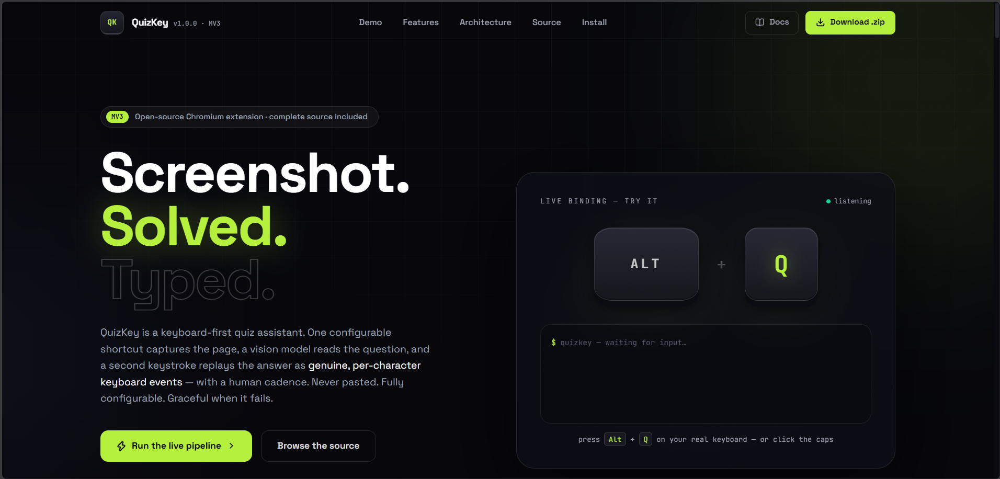

# QuizKey — AI Quiz Assistant (Manifest V3)


Press a keyboard shortcut → QuizKey screenshots the visible tab, sends it to a
vision AI model, detects the quiz question and answers, then types the best
answer into the page with **realistic, per-character keyboard events** — never
a paste.

> Use responsibly and respect the academic-integrity and site policies that
> apply to you.

---

## Project structure:

```
extension/
├── manifest.json               # MV3 manifest: permissions, commands, wiring
├── background/
│   └── service-worker.js       # Orchestrator: commands → capture → AI → messaging
├── content/
│   ├── content-script.js       # Message router (background ↔ DOM modules)
│   ├── dom-detector.js         # Finds question, answer options & input fields
│   ├── typing-simulator.js     # Per-character keydown/keypress/input/keyup stream
│   ├── overlay.js              # In-page status/result/error UI
│   └── overlay.css             # Namespaced overlay styles (qk-*)
├── popup/
│   ├── popup.html / .css / .js # Quick actions, shortcuts, latest result
├── options/
│   ├── options.html / .css / .js # Full settings: API, capture, typing, shortcuts
├── lib/
│   ├── ai-client.js           # facade over lib/adapters/*            # OpenAI-compatible vision client + JSON validation
│   ├── prompts.js              # System prompt & message construction
│   ├── storage.js              # Settings + per-tab results (chrome.storage.local)
│   └── errors.js               # Error codes → user-facing messages
└── icons/
    └── icon.png
```

### Data flow:

```
Alt+Q ─► commands API ─► service worker ─► tabs.captureVisibleTab
                                     │
                                     ▼
               ai-client.js ──► vision model ──► validated JSON
                                     │
                    saveResult ◄─────┘
                                     ▼
              content-script ─► overlay (question, answer, confidence)
                              └► dom-detector highlights matches

Alt+A ─► service worker ─► stored result ─► content-script
        ├─ choice? ─► dom-detector.findChoiceElement ─► pointer/click replay
        └─ text?   ─► dom-detector.findInputField
                    ─► typing-simulator.typeText (delay + jitter, char by char)
```

---

## Installation (Chromium: Chrome, Edge, Brave, Arc…):

1. Copy/download the `extension/` folder anywhere on disk.
2. Open `chrome://extensions` (or `edge://extensions`).
3. Enable **Developer mode** (top-right toggle).
4. Click **Load unpacked** and select the `extension/` folder.
5. Pin the extension, then open its **Options** page:
   - paste your API key
   - confirm/adjust the base URL and model
   - tune typing delay & capture format

### Configure the keyboard shortcuts:

- Default: `Alt+Q` capture & analyze, `Alt+A` type answer.
- Rebind from the Options page (supported browsers) or directly at
  `chrome://extensions/shortcuts`.
- Constraints set by Chromium: must include `Ctrl` or `Alt` (optionally
  `Shift`); browser-reserved combos are rejected.

## Supported AI providers:

QuizKey speaks **three API dialects natively** and picks the right one from the base
URL (or you pin it under *API dialect* in settings):

| Dialect | Endpoint QuizKey calls | Auth header |
| --- | --- | --- |
| OpenAI Chat Completions | `POST {base}/chat/completions` | `Authorization: Bearer` (Azure: `api-key`) |
| Google Gemini (native) | `POST {base}/models/{model}:generateContent` | `x-goog-api-key` |
| Anthropic Messages | `POST {base}/messages` | `x-api-key` + `anthropic-version` |

Presets (all URLs verified against the providers' documentation, Sept 2026):

| Provider | Base URL | Default model | Notes |
| --- | --- | --- | --- |
| **OpenAI** | `https://api.openai.com/v1` | `gpt-4o-mini` | Also `gpt-4o`, `gpt-5.6-terra`, `gpt-5.6-sol`. GPT‑5.x reject `temperature`/`max_tokens`; QuizKey adapts automatically. |
| **Anthropic Claude** | `https://api.anthropic.com/v1` | `claude-sonnet-5` | Native Messages API. Also `claude-haiku-4-5-20251001`, `claude-opus-5`. Sonnet 5 rejects non-default sampling params — never sent. |
| **Google Gemini (native)** | `https://generativelanguage.googleapis.com/v1beta` | `gemini-3.8-flash` | Recommended for Gemini. Key from [AI Studio](https://aistudio.google.com/apikey). Gemini 3 always thinks; QuizKey asks for `thinkingLevel: low` + JSON output. |
| **Google Gemini (OpenAI layer)** | `https://generativelanguage.googleapis.com/v1beta/openai` | `gemini-3.8-flash` | Same key. Google labels this layer beta — prefer the native preset. |
| **OpenRouter** | `https://openrouter.ai/api/v1` | `openai/gpt-4o-mini` | One key, many models — pick one with image input. |
| **OmniRoute** (local gateway) | `http://localhost:20128/v1` | `gemini-3-flash` | `npm i -g omniroute && omniroute`; key from Dashboard → Endpoints. Model IDs are plain names (`gemini-3-flash`, `auto`, `claude-sonnet-4-5`). Use a vision model — `auto` may route to a text-only one. |
| **LM Studio** (local) | `http://localhost:1234/v1` | *(empty → first loaded)* | Enable **CORS** in the Developer tab. Click **Grant access** in QuizKey settings. |
| **Ollama** (local) | `http://localhost:11434/v1` | `llama3.2-vision` | `OLLAMA_ORIGINS="*" ollama serve` then `ollama pull llama3.2-vision` (or `qwen2.5vl`, `gemma3`). Click **Grant access**. |
| **Azure OpenAI** | `https://RES.openai.azure.com/openai/deployments/DEP` | your deployment | QuizKey adds `api-key` header + `api-version` query. |
| **Custom** | any OpenAI-compatible `/v1` | — | vLLM, llama.cpp, Groq, Mistral, xAI, Together… |

OpenAI, Anthropic, Gemini and OpenRouter are granted in the manifest. For any other
origin QuizKey requests the optional host permission the moment you change the base
URL (and via **Grant access** / **Test connection**). Without that grant the request is
subject to CORS, which local servers block — the usual cause of "nothing happens".

### Provider-quirk handling (why earlier versions "didn't work"):

- **Reasoning models** (Gemini 2.5/3.x, GPT‑5.x, o‑series, Claude 4.6+/5, DeepSeek‑R1…)
  get a 4096‑token output budget, low reasoning effort and **no `temperature`**.
  Otherwise hidden thinking eats the whole budget and the reply is empty.
- A `400` complaining about `max_tokens`, `temperature`, `response_format`,
  `reasoning_effort` / `thinkingConfig` is retried with that parameter fixed
  (`max_tokens → max_completion_tokens`, JSON mode dropped, …); the quirk is remembered.
- A base URL missing `/v1` (e.g. `http://localhost:11434`) is retried with it; pasted
  endpoint suffixes (`/chat/completions`, `/messages`, `:generateContent`) are stripped.
- `message.content` may be a string or an array of parts; Gemini thought parts are skipped.
- Local endpoints don't require an API key; an empty model on LM Studio means "first loaded".
- The provider's own error text (wrong key, unknown model, quota…) is shown in the toast
  and in **Settings → Recent API calls**.
- The overlay and outlines are hidden **before** the screenshot so the model never sees
  a previous answer card.

### Debugging a provider:

Settings → **Test connection** lists the endpoint's models (and warns if yours isn't
there), **Load models** fills the model picker, and **Run diagnostic** sends a built-in
sample quiz image through the real capture → analyze pipeline and prints the parsed
answer or the exact provider error. **Recent API calls** shows URL, status and timing
of the last requests (keys are never logged).

## Configuration reference:

| Key | Type | Default | Description |
| --- | --- | --- | --- |
| `provider` | string | `openai` | Preset id from `lib/providers.js`. |
| `apiStyle` | `auto` \| `openai` \| `gemini` \| `anthropic` | `auto` | API dialect; `auto` infers it from the URL. |
| `apiBaseUrl` | string | `https://api.openai.com/v1` | Provider base URL. Custom hosts request optional host permission. |
| `apiKey` | string | `""` | Stored only in `chrome.storage.local`; sent only to the endpoint. Optional for localhost / LAN endpoints. |
| `requestTimeoutMs` | number | `90000` | Abort threshold — reasoning models can take a while. |
| `maxOutputTokens` | number | `4096` | Completion budget (sent as `max_tokens`, or `max_completion_tokens` when the provider demands it). Must be large for reasoning models. |
| `maxImageEdge` | number | `1600` | The screenshot is downscaled in the worker so its longest edge is ≤ this — smaller upload, fewer vision tokens. `0` disables. |
| `model` | string | `gpt-4o-mini` | Any vision-capable chat model. Empty = first model the server lists (local servers). |
| `requestTimeoutMs` | number | `45000` | Hard abort for AI requests. |
| `captureFormat` | `"png"\|"jpeg"` | `jpeg` | Screenshot encoding. |
| `jpegQuality` | number | `0.85` | 0.1 – 1.0, ignored for PNG. |
| `typingDelayMs` | number | `60` | Base delay between keystrokes. |
| `typingJitterMs` | number | `45` | Random 0…n ms added per keystroke. |
| `autoType` | boolean | `false` | Type right after analysis (skip `Alt+A`). |
| `clickChoice` | boolean | `true` | Click detected MCQ options with pointer events. |
| `highlightMatches` | boolean | `true` | Outline detected question/field/answer. |
| `extraInstructions` | string | `""` | Appended to the analysis prompt. |
| `overlayPosition` | string | `top-right` | Where the in-page panel appears. |

## Typing realism:

Each character dispatches the exact sequence a physical keyboard produces:

`keydown → keypress → beforeinput → (native value mutation) → input → keyup`

- Uses the **native value setter**, so React/Vue/Angular controlled inputs
  register every keystroke.
- Respects caret position and selection ranges; supports `contenteditable`
  via `insertText`.
- Respects `preventDefault()` — if the page vetoes a key, the simulator
  skips it instead of forcing state.
- Human cadence: configurable base delay, random jitter, longer pauses at
  word boundaries and after punctuation.

## Error handling:

Every failure path produces a typed `QuizKeyError` with a stable code and a
user-facing message shown as an on-page toast and in the popup:

`CAPTURE_FAILED` · `API_KEY_MISSING` · `API_TIMEOUT` · `API_REQUEST_FAILED` ·
`NO_QUESTION` · `NO_ANSWER` · `NO_RESULT` · `NO_INPUT` · `MESSAGING_FAILED` ·
`RESTRICTED_PAGE` …

The action badge mirrors state: `…` working, `✓` success, `!` failure.

## Security notes:

- MV3 with a **module service worker**; no remote code, no `eval`.
- Minimal permissions: `activeTab` (granted by the shortcut gesture),
  `storage`, `commands`, `scripting` (only for on-demand injection on tabs
  opened before install). The API host is a host-permission; custom endpoints
  use **optional** host permissions requested at runtime.
- The API key never enters page context — AI calls happen only in the
  background worker.
- Content scripts run in the isolated world and communicate via typed
  messages only.

## Troubleshooting:

### “This page is restricted…” — what it means and what to do

QuizKey classifies the tab and tells you the exact cause. The cases:

| Page kind | Why | What you can do |
| --- | --- | --- |
| `chrome://` / `edge://` / `brave://` / `about:` pages (settings, history, new tab…) | Chromium blocks **every** extension from capturing or scripting built-in pages. | Nothing — open a normal website. Not fixable by design. |
| Web Store / extension galleries | Same hard browser rule, even over https. | Nothing — capture quiz pages on regular sites instead. |
| Built-in **PDF viewer** | It runs inside a privileged extension page. | Download the PDF or move the question to a web page. |
| `file://` local files | **Capture/analysis works out of the box.** Typing & the overlay need a per-extension file grant (browser security rule). | **QuizKey Settings → “Local files (file://)” → Enable file access** (one click), then reopen the file. If you prefer Chrome's own switch: `chrome://extensions → QuizKey → Details → “Allow access to file URLs”` — note Chrome can hide that toggle unless the extension declares URL permissions (QuizKey deliberately asks at runtime instead). |
| Grant seems ignored / file still silent | Couldn't see WHY without a visible error — hidden cause: the model answered prose instead of JSON. | QuizKey now surfaces the model's best-effort prose answer in the overlay instead of failing silently. Use a stronger vision model if the question is image-heavy. |
| Tab was open **before** install/reload | Its content script is missing. | QuizKey **auto-injects on capture** (via `chrome.scripting`) — if you still see a messaging error, reload that tab once. |

### Other common issues:

- **“Unreadable response” / empty reply** — the model is not vision-capable, or spent its
  output budget on reasoning. Use a vision model; for reasoning models keep `maxOutputTokens`
  ≥ 4096. Prose replies are now shown as a low-confidence answer instead of failing.
- **“No permission to contact …”** — open settings and click **Grant access** next to the
  base URL (custom / local endpoints only; OpenAI, Gemini and OpenRouter are pre-granted).
- **Local server unreachable** — Ollama: `OLLAMA_ORIGINS="*" ollama serve`; LM Studio: turn
  on CORS. Both need the host-permission grant above.
- **HTTP 400 on GPT‑5 / o‑series** — handled automatically (`max_completion_tokens`, no
  `temperature`); if a provider rejects another parameter the toast now shows its exact text.
- **Test connection fails on OmniRoute/gateways** — QuizKey first tries `GET /models`,
  then falls back to a 1-token chat ping automatically.
- **Gemini gives NO_ANSWER on dense pages** — lower the JPEG quality slider or use
  a stronger model (e.g. `gemini-3.8-pro`).
- **Nothing types** — focus the target field once, then press `Alt+A`; the
  focused field always wins over heuristics.
